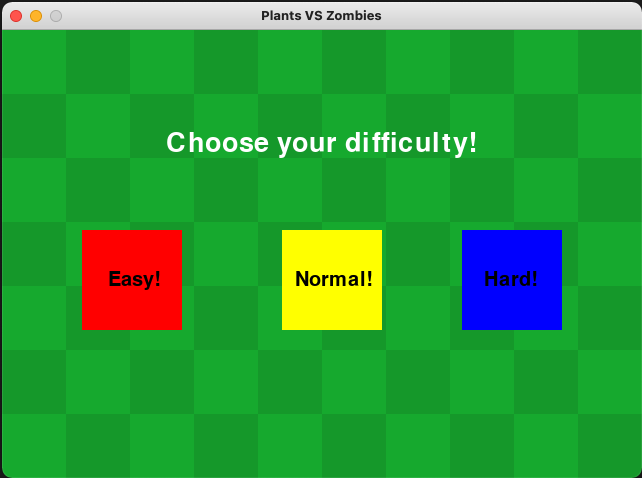
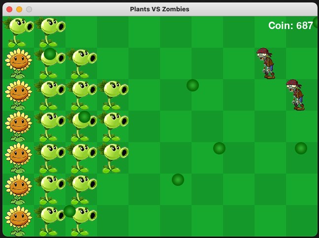

# Plants VS Zombies
This is my implementation of the game **Plants VS Zombies** in Python.

When the game is launched, the player get to choose the difficulty of the game
\

In the game, the player get to plant PeaShooters to shoot at the zombies, or plant SunFlower to increase their income
\