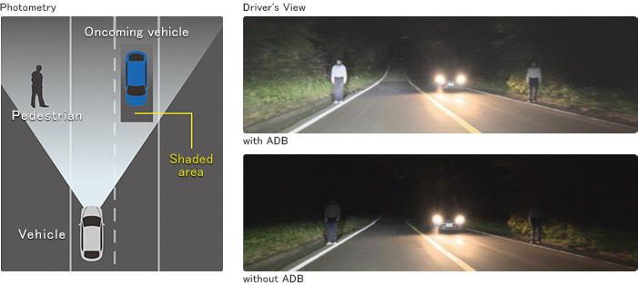
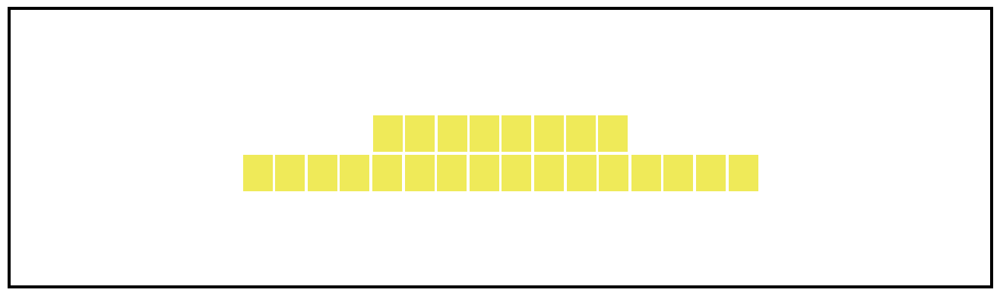
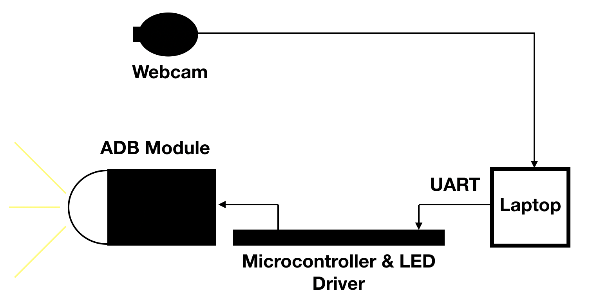
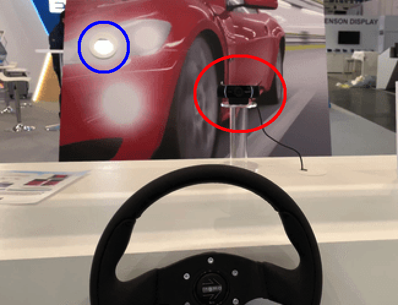
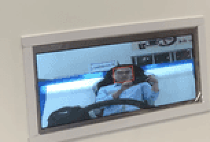

# ADB (Adaptive Driving Beam)
As Level-5 self driving cars is becoming ever closer to being realised, many car makers are looking for means to improve the safety of our cars during the mean time. ADAS (Advanced Driver-Assistance Systems) are the way many car maker are approaching this problem. The concept of Adaptive Driving Beam (ADB) is a part of this system. An ADB is a type of headlight module used in many premium cars to help driver safety during night time driving by reducing incoming glare and reflections from road signs. ADB are now included in many luxury cars, including the Mercedes Benz E-Class, which includes an 84-pixel variant. The headlamp module can be seen below (from https://www.eenewsautomotive.com/news/multi-beam-led-headlamp-packs-84-light-pixels)
\
As mentioned already, the purpose of ADB is to reduce glare and improve safety of the other drivers and pedestrians on the road, which can be seen below (From Koito at the Japan Automotive Engineering Exposition)
\
For the 2018 Electronica Exhibition in Munich, Germanty, one of the main attraction at Everlight Electronic's booth is an ADB module designed by me.
The headlamp module uses 24pcs of Everlight's latest headlamp LEDs, and is controlled by a custom trained MobileNet SSD.

## Overview of the system
An ADB module can be broken down into the following section:
1. The photometry of the headlamp
2. The control system that determines which section of the headlight is turned off
3. The heat dissipation of the LED driver circuitry

To determine the ideal photometry of the ADB module, optical simulation simulation was performed based on the rayfile of the headlamp LED to determine the optimal number of LEDs to use. The final setup can be seen below (not to scale, just a representation of the final product)
\
The simulation showed that the the ideal setup would be to separate the LEDs into two rows, 16pcs at the bottom and 8pcs at the top. There are other additional optical parts used to for the module, however those information cannot be shared here.

There need a control system that determine which LED pixel need to be turned off to prevent glare.
Since the Electronica Exhibition is going to be in a hall, and we want the headlamp module to be interactive with the guests of our booth, the best object to track was determined to be peoples faces. After some tests with traditional face detectors like Haar Cascades, OpenCV's Deep Learning face detector, it is determined that the Deep Learning approach is much more reliable.
To improve the accuracy, it was decided that the a custom network will be trained.
In the end, a custom face detector based on MobileNet SSD was used at the exhibition. For fluidity of the module, it is necessary for the model to be run on a laptop, as the display of what the system is seeing should be run at 24FPS or higher (the final demo was driven at around 23.6FPS).

Since LEDs are very sensitive to heat (at higher temperature the brightness will drop off quite a bit), the LED's driver circuit was chosen carefully to make sure heat does not build up to quickly on the LED's PCB. Since we are in an exhibition hall where there are plenty of people visiting, the LEDs are not driven at their typical current of 1A. After some tests and simulation it was determined that the LED driver circuit would output 300mA per LED and each LED would be driven with PWM.

For the laptop to communicate with the LED driver, an ARM based microcontroller from Nuvoton was used as the interface.
The laptop will determine which region(s) should be turned off, and transmit the control parameters to the microcontroller via UART. The message structure looks like this:
["Start", NUM, NUM, NUM, NUM, NUM, ..., NUM, "End"], where "Start" is the trigger start for the current frame, NUM will be the PWM duty cycle of the LEDs (NUM has the value of 100, 75, 50, 25, 0) and "End" is the end of frame message. The order of transmission will be LED1->LED2->LED3->...->LED24.

The complete ADB module setup can be summarised in the image below:
\

## ADB Module In Action
\

In the clip above, it can be seen that there is a camera placed near where the participant is, while the ADB Headlamp module is placed on the wall (the red circle highlighs the camera while the blue circle highlights the ADB module).
\

In the display screen, the participant can see that as they move, the pixels corresponding to where they are sitted will turn off accordingly.
\
