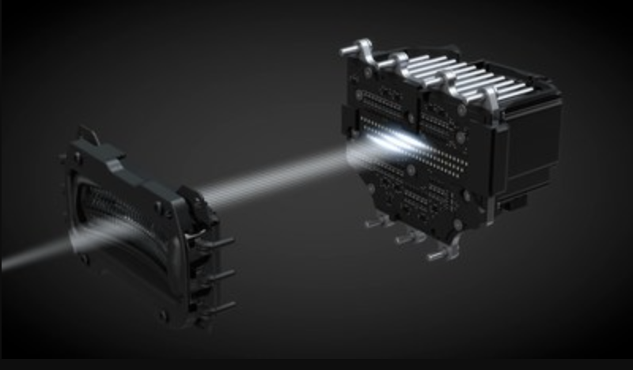

# ADB (Adaptive Driving Beam)
As Level-5 self driving cars is becoming ever closer to being realised, many car makers are looking for means to improve the safety of our cars during the mean time. ADAS (Advanced Driver-Assistance Systems) are the way many car maker are approaching this problem. The concept of Adaptive Driving Beam (ADB) is a part of this system. An ADB is a type of headlight module used in many premium cars to help driver safety during night time driving by reducing incoming glare and reflections from road signs. ADB are now included in many luxury cars, including the Mercedes Benz E-Class, which includes an 84-pixel variant.

For the 2018 Electronica Exhibition, one of the main attraction at Everlight Electronic's booth is 

## ADB (Adaptive Driving Beam) at Electronica 2018
* Goto the following webpage for more detail

## ISELED based RGB LED with embedded IC
* Goto the following webpage for more detail

## Open Source RGB LED with embedded IC
* Goto the following webpage for more detail
